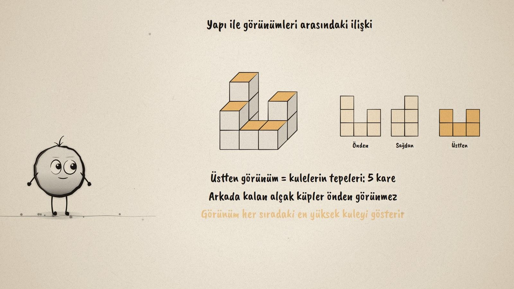
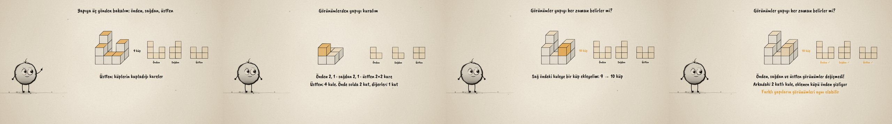

# Küpten Kuleler · Cube Structures and Their Views

**▶ Tarayıcıda izleyin / Watch in the browser:** https://hakanatas.github.io/kupten-kuleler/ 
**⬇ MP4 + altyazılar / MP4 + subtitles:** [Releases](https://github.com/hakanatas/kupten-kuleler/releases) 
**✎ Kullanılan istem / The prompt behind it:** [PROMPT.md](PROMPT.md) 
**🎞 Bütün filmler / All films:** [Nokta'nın Filmleri](https://hakanatas.github.io/nokta-filmleri/?sinif=7)

> **TR —** 7. sınıf matematik "Geometrik Nicelikler" temasındaki MAT.7.4.1 öğrenme çıktısı için hazırlanmış, tamamen JavaScript ile çizilen 92 saniyelik mürekkep animasyonu. Eş küpler tek tek yerine oturuyor ve 9 küplük bir yapı çıkıyor. Yapıya önden, sağdan ve üstten bakılıyor: bakılan yöndeki yüzler parlıyor ve görünümler kare kare çiziliyor (önden 3, 1, 2; sağdan 2, 3; üstten 5 kare). Sonra tersine gidiliyor: önden 2, 1, sağdan 2, 1 ve üstten 2×2 kare verilen görünümlerden 5 küplük yapı kuruluyor. Yapı ile görünümleri arasındaki ilişki gösteriliyor: önden ve yandan görünümün her sütunu o sıradaki en yüksek kule, üstten görünüm kulelerin tepeleri. Son olarak sağ öndeki kuleye bir küp ekleniyor; arkadaki kule onu gizlediği için üç görünüm de değişmiyor: farklı yapıların görünümleri aynı olabilir. Altyazılar Türkçe, İngilizce ya da ikisi birlikte seçilebilir.

A 92-second ink animation for **7th-grade maths**. Nokta, the ink character from [The Learning Ink](https://github.com/hakanatas/the-learning-ink), is the guide again. A structure is just a height table `H[y][x]` in `scenes/scene1.js`: the cubes are drawn from it in a cabinet projection, and the three views are computed from it too (`front`, `side`, `top`), so adding the hidden cube in scene 5 is a one-line change to the table.

## Learning outcome

MEB, Türkiye Yüzyılı Maarif Modeli, Ortaokul Matematik, 7th grade, "Geometrik Nicelikler" theme:

**MAT.7.4.1. Eş küplerle oluşturulan yapılar ile görünümleri arasındaki ilişkiyi çözümleyebilme**
- a) Eş küplerle oluşturulan yapıların farklı yönlerden görünümlerini çizer ve görünümleri verilen yapıları eş küplerle oluşturur.
- b) Oluşturduğu yapı ile görünümleri arasındaki ilişkileri belirler.

## Scenes

| # | Time | Scene | What happens | Outcome |
|---|---|---|---|---|
| 1 | 0–10 s | Bir yapı | Nine equal cubes settle into a structure. | a |
| 2 | 10–28 s | Üç görünüm | The front, right and top faces glow as the three views are drawn. | a |
| 3 | 28–46 s | Görünümden yapıya | From three given views, a 5-cube structure is built and checked. | a |
| 4 | 46–64 s | Yapı ve görünüm | Each column of a view is the tallest tower in that row; the top view is the tops of the towers. | b |
| 5 | 64–80 s | Gizli küp | One more cube, 10 cubes, and all three views stay the same. | b |
| 6 | 80–92 s | Aklında kalsın | Same views can belong to different structures. | a–b |

## Running it

- **Preview:** double-click `index.html` (it works offline).
- **MP4:** run `npm install` once, then `npm run export -- --format=horizontal --captions=tr`.
- **Subtitles and narration:** `npm run srt` writes `out/captions_*.srt` and `narration_notes.txt`.
- **Editing:**
  - Caption text, timings and narration notes: `captions.js`
  - Everything on screen is drawn by `LI.world(t)` in `scenes/scene1.js` (the cubes, the views, the words); the other scenes only set the camera.
  - Nokta's poses: `src/draw/film.js`; layout for 16:9 and 9:16: `src/draw/kd.js`

It uses the same engine as The Learning Ink: `renderFrame(t)` as a pure function of time, seeded randomness, and frame-by-frame export.
